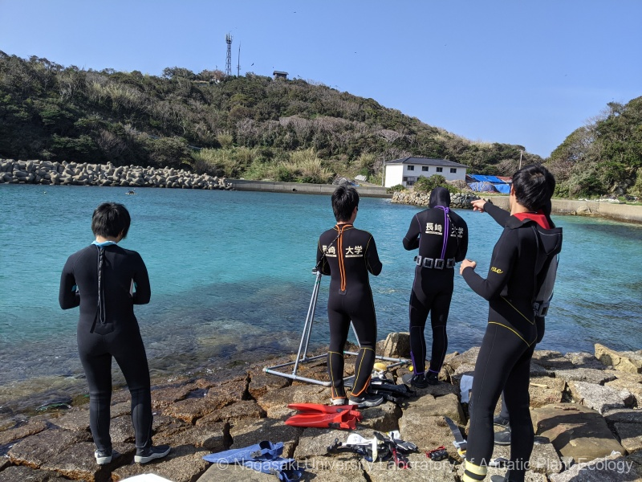
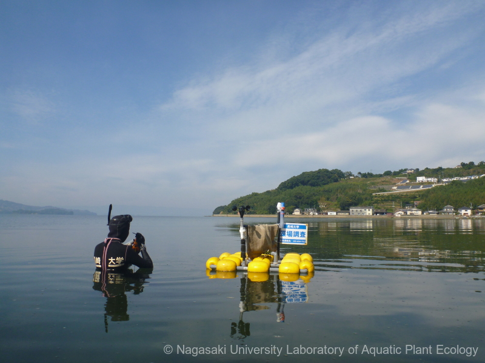

### 研究室について| About the Lab

:::{.panel-tabset}
## 日本語
陸上植物は草原や森林のような生態系をつくり，生物多様性や二酸化炭素固定能力の高い場として知られています。海藻や海草は，海中に森や草原のと同じように生態系を作っています。

水圏植物生態学研究室では，海藻や海草がつくる生態系（藻場）の基礎科学と応用科学についての研究をしています。とくに，Blue Carbon・総一次生産量に関する研究，藻場回復の関する調査研究と技術開発に注目しています。

## English
Terrestrial plants create ecosystems such as meadows and forests, which are known as areas with high biodiversity and high carbon dioxide fixation capabilities. Seaweeds and seagrasses create similar ecosystems in the ocean, much like underwater forests and meadows.

At the Laboratory of Aquatic Plant Ecology, we conduct basic and applied scientific research on the ecosystems (macrophyte beds) created by seaweeds and seagrasses. In particular, we focus on research related to Blue Carbon and gross primary production, as well as investigative research and technological development for the restoration of these ecosystems.
:::

::: {layout-ncol="2"}

:::

-----
**HPはつねに未完成です。This HP is forever under construction.**
