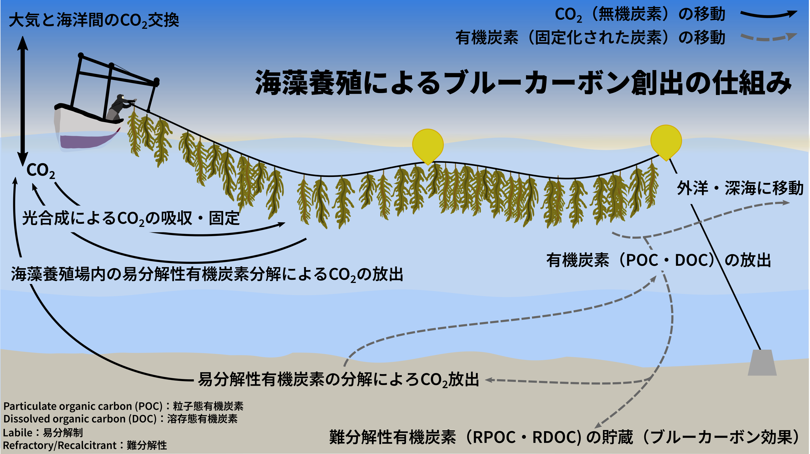
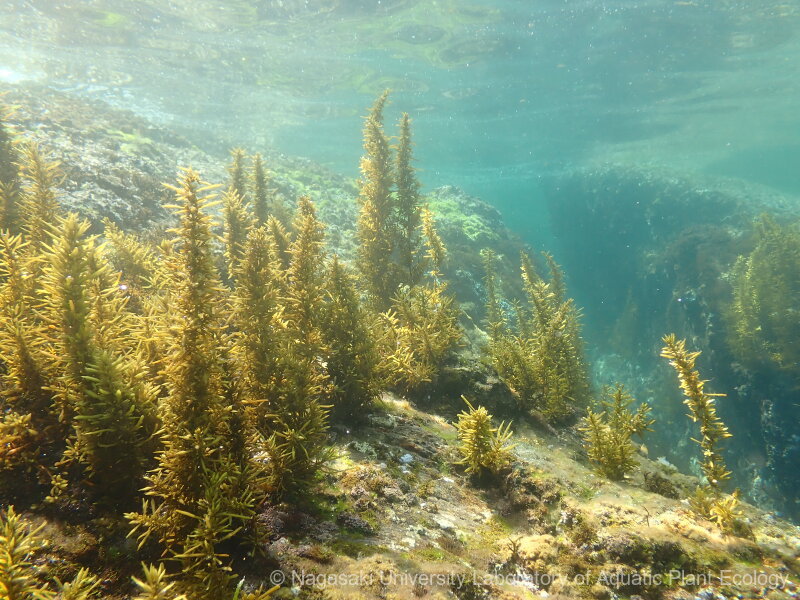
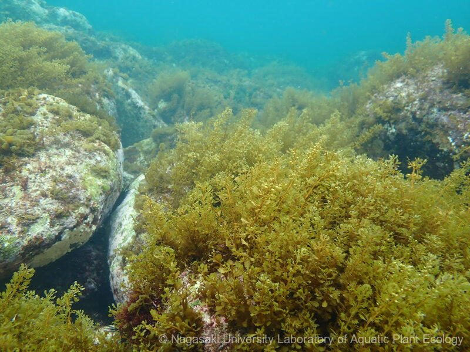
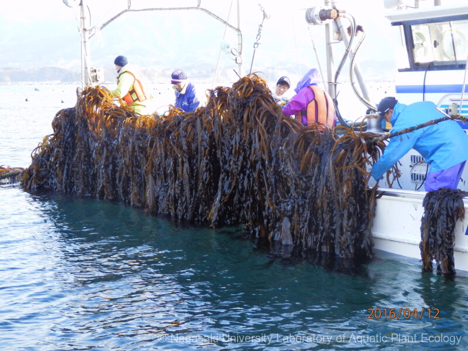
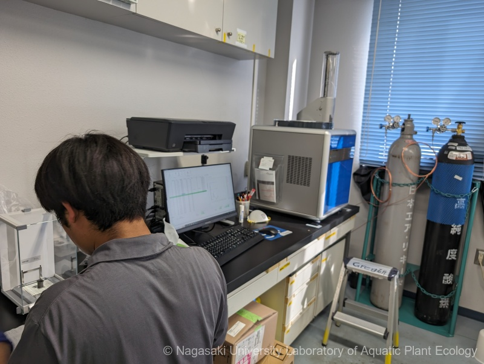
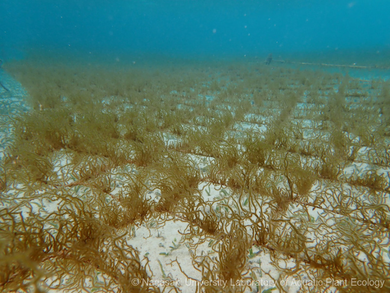
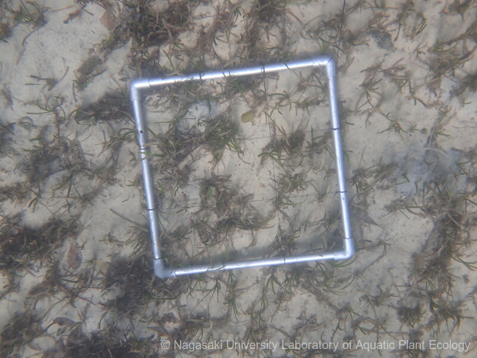
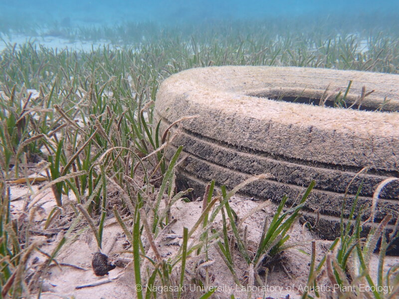

持続可能に安全な食料を提供するために、海辺の生きもが暮らす環境を守り、健全な姿に戻す研究を行っています。 具体的には次の二つの柱を中心に活動しています。

長崎大学水圏植物生態学研究室では、持続可能に安全な食料資源を提供し続けられるよう、沿岸生態系の修復と保護に取り組んでいます。 そのために、環境汚染の影響を受ける藻場（海藻・海草）を対象に、二つの主要な研究領域にフォーカスしています。

まず第一に、水中の「森」とも呼ばれるこれらの生態系の健全性を評価する技術の開発・改良を行っています。 生態系の面積や密度、生物多様性を定量化することで、ストレスや劣化の初期兆候を捉えることが可能になります。 特に海洋ごみによる汚染（プラスチックごみなど）が藻場の構造や機能にどのような変化をもたらすかを調査しています。

次に、これらの生態系を修復・保護するための基礎研究を推進しています。 藻場が大気中の二酸化炭素を取り込み、「ブルーカーボン」として貯留する仕組みを解明し、炭素貯留量の推定精度と正確性の向上を目指しています。 藻場における炭素固定能力を正しく評価し、気候変動緩和に果たす役割を明らかにすることが研究のゴールです。

これらの研究を支えるために、研究室の活動の半分以上のはフィールドワークです。 藻場の範囲と密度を定期的に測定し、そこに堆積する海洋ごみや堆積物を採取しています。 実験室では、Elementar社および島津製作所製の実験装置を用いて、堆積物や海水中の有機炭素含有量を分析しています。 フィールド観測とラボ解析、データ解析を組み合わせることで、藻場の衰退と回復するプロセスなどを総合的に理解しようと努めています。

本研究室では、ブルーカーボンに関連する取り組みとして、海藻養殖場の炭素固定能の評価を行っています。 特に、養殖された海藻はその成長過程で大気中のCO~2~を吸収し、バイオマスや堆積物の形で炭素を貯留する可能性があることから、気候変動緩和策として注目されています。

当研究グループの主要な成果のひとつである [Sato et al.（2022）『Frontiers in Marine Science』](https://doi.org/10.3389/fmars.2022.861932) では、日本の海藻養殖場における炭素固定量を定量的に評価しました。 この研究により、収穫された海藻バイオマスの利用方法によっては、養殖場が実質的な炭素吸収源（カーボンシンク）として機能しうることが示されました。 こうした知見は、今後の温室効果ガス排出量の国際的な算定や政策に、海藻養殖が正式に組み込まれる道を開くものです。

さらに、2024年9月18日付の長崎大学のプレスリリースでは、本研究室が代表を務める戦略的創造研究推進事業（CREST）の採択が発表されました。 このプロジェクト「海藻養殖漁場におけるブルーカーボンの高精度定量化と固定能評価」は、長崎大学として初のCREST採択であり、研究は、Gregory Nishihara 教授（長崎大学）、小西照子教授（琉球大学）、および理研食品株式会社との共同で進められています。

本プロジェクトでは、生態系純一次生産量（NEP）に注目し、ワカメ（宮城県）およびオキナワモズクモズク（沖縄県）の養殖場を対象に、海藻が吸収・放出するCO~2~の動態を詳細にモニタリングすることで、CDR（大気中の二酸化炭素除去）能力を高精度に評価します。 また、海藻が放出する多糖などの有機物の挙動も追跡し、ブルーカーボンとしての実効性を総合的に明らかにすることを目指しています。 これにより、カーボンクレジットの制度設計や、海藻産業のカーボンニュートラル化に貢献することが期待されています。

## 藻場生態系海藻
日本では, いそやけが進んでいて, いそやけのような現象は世界中におきています。 植食生成物が大量に増えたのがいそやけの主な原因だと考えられています。 私達はいそやけをおこす課程と生態系が回復する課程の研究に取り組んでいます。

::: {layout-ncol="2"}

:::

## ブルーカーボン
海洋生態系が固定する炭素は Blue carbon と呼ばれるようになったのは最近のことです。 水産学の視点からブルーカーボンをどのように考えるのか, どのように観測するのかについても研究しています。

::: {layout-ncol="3"}

:::

## 海洋ごみ
我が国の海洋ごみ問題は今後どうなるでしょうか。回収・処理技術は50年ほぼ進化せず、研究は定量調査や生物影響評価が中心です。 ごみが藻場生態系に及ぼす影響は未解明のため、私たちは新たなモニタリング手法の開発と影響評価を行い、藻場の保全と持続的利用を目指しています。

::: {layout-ncol="2"}

:::